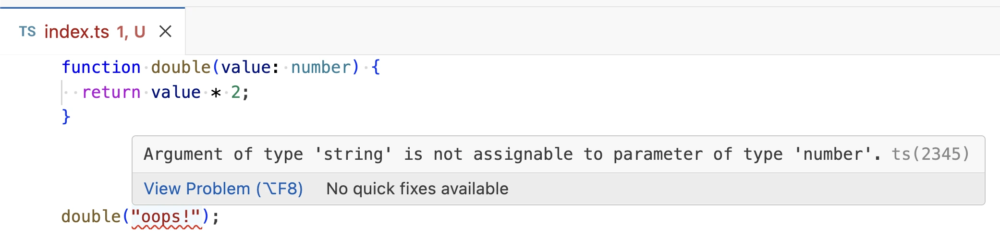

# What is TypeScript?

"TypeScript", or "TS" for short, receives a lot of attention and discussion online.
You might hear phrases like _"TypeScript catches my bugs"_ or _"TypeScript lets me write my types"_.
If you've never worked with TypeScript before, it can seem like the word "TypeScript" refers to a whole collection of features or tools.

That's because _"TypeScript"_ does refer several different tools: four, in fact.
We'll explore what those four things are in this blog post, as well as why you'd want to use them.

## 1. Language

_"TypeScript"_ most commonly refers to the TypeScript programming language.
A programming language describes a set of syntax that describes actions for a computer to take.

The TypeScript language includes all of JavaScript's syntax, plus new syntax to describe "types": how values in code are expected to behave.
That's why developers often call TypeScript a _"superset of JavaScript"_ [^1], or _"JavaScript with syntax for types"_.

The following block of code is an example of TypeScript syntax:

```ts
function double(value: number) {
  return value * 2;
}
```

The `: number` characters in that code block are an example of TypeScript-specific types syntax.
They're a _"type annotation"_ that tells the reader that the `value` parameter is meant to be a number.
Everything else in the code block is valid JavaScript.

## 2. Type Checker

A "type checker" is a program that:

1. Reads in source code syntax
2. Checks if anything seems to be used in ways that won't work as expected

The TypeScript type checker is a program that checks JavaScript and/or TypeScript source code.
It lets you know if the way any value is used seems to not match with the way it was declared or later modified.
A mismatch between the declared intent of a value with how it's used are typically called a _"type error"_.

For example, providing an argument of one type to a function that declared it takes a different type is a type error:

```ts twoslash
// @errors: 2345
function double(value: number) {
  return value * 2;
}

double("oops!");
```

The logic a type checker uses to produce type errors is called a _"type system"_.
TypeScript's type system describes what its type checker should report based on different combinations of types and values in code.

Developers often run TypeScript's type checker via [3. Compiler](#3-compiler) and [4. Language Services](#4-language-services).

:::tip
Type checkers are a form of _"static analysis"_: meaning they analyze your source code without running it.
Tools such as test runners that run code and analyze the result are referred to as _"dynamic analysis"_.
:::

## 3. Compiler

A compiler is a program that takes code in a high-level language and outputs a transformed version of that code in a lower-level language.
Compilers for typed languages such as TypeScript generally run type checking as a part of compiling.

TypeScript provides a compiler with its command-line, `tsc`.
`tsc` is able to read in TypeScript source files, type check those files, output the equivalent output JavaScript files, and log any type errors it found during type checking.

For example, running `tsc` on a file with a type error might look like:

```plaintext
$ tsc index.ts

index.ts:5:8 - error TS2345: Argument of type 'string' is not assignable to parameter of type 'number'.

5 double("oops!");
         ~~~~~~~

Found 1 error in index.ts:6
```

TypeScript's `tsc` command-line is highly configurable.
You can read more about it on [TypeScript Handbook > `tsc` CLI Options](https://www.typescriptlang.org/docs/handbook/compiler-options.html)

## 4. Language Services

Language services are tools that allow editors such as VS Code to interact with the language's programs.
TypeScript's language services allow editors to:

- Compiler TypeScript source files in real-time as you edit them
- Indicate types and type errors as you edit code or select values with your cursor
- Ask TypeScript for automated actions such as finding all references or renames

This screenshot shows VS Code visualizing a type error with a red squiggly and a popup containing the error's message:



## Why Use TypeScript?

TypeScript means four separate things, three of which are programs.
Many web developers swear by those four TypeScripts and use each to write much of rhtier web applications.
Why are so many developers so passionate about TypeScript?

### Bug Checking

TypeScript's type checker is a powerful program to check whether the _intent_ of code matches up with _usage_.
Type checking can detect many mistakes at development-time -- before the code is run in tests or by users.
A research study in 2017 found TypeScript able to catch upwards of 15% of observed bugs [^2].

No single strategy or tool can eliminate all bugs from an application.
But eliminating 15% or more of bugs at development-time is quite appealing.

### Development Assistance

TypeScript's language services provide a suite of features that can make coding faster and more reliable.
These features are often referred to as _"IntelliSense"_, a term Microsoft uses to refer to features in IDEs.

Commonly used development assistance provided by TypeScript's language services include:

- _Go-to-definition_: going from a place a construct is used to where it was defined
- _Find-all-references_: given a the definition, listing all the places it's used
- _Rename_: updating a name in every place in code that refers to it

Many developers prefer using TypeScript's language service features whe possible because it saves time and reduces risk of human error.
Renaming a variable, for example, can take a long time if there are many places that use the variable.
Common names like "`value`" can also be difficult to manually rename if other variables share that name.

You can read more about editor features in [VS Code's IntelliSense guide](https://code.visualstudio.com/docs/editing/intellisense).

### Standardized Code Documentation

Although JavaScript allows writing comments to describe code, there is no formal specification for how to use those comments.
The [JSDoc](https://jsdoc.app) community standard for writing comments is only a loose standard and does not contain a formal type checker.

TypeScript types, on the other hand, are a formalized way to describe the intent behind code values.
Types are verified by type checking to have valid syntax and match up with values.
Many TypeScript developers view fully describing a project's types as one of the first necessary step in its documentation.

## Next Steps

The official [TypeScript Website](https://www.typescriptlang.org) is an excellent introduction to the TypeScript language and tooling.
Its [TypeScript Handbook](https://www.typescriptlang.org/docs/handbook/intro.html) includes [_Getting Started_ guides](https://www.typescriptlang.org/docs/handbook/intro.html#get-started) for developers with different areas and levels of experience.

[_Learning TypeScript_ (O'Reilly)](https://www.oreilly.com/library/view/learning-typescript/9781098110321/) is one popular resource for diving into TypeScript.
It covers the foundations of TypeScript, how to work with its type system, and the aspects of its type checker and type system used by most projects.

---

This article is a text version of [TypeScript in 2 minutes ft Josh Goldberg](https://www.youtube.com/watch?v=KMj6tmv2kNo&ab_channel=OfferZenOrigins).

Got your own TypeScript questions?
Ask [@learningtypescript.com](https://bsky.app/profile/learningtypescript.com) on Bluesky and the answer might become an article too!

[^1]:
    TypeScript is not an _exact_ superset of JavaScript.
    There exist a small set of edge cases where syntax differs between the two.
    It's exceedingly unlikely you or any developer you know has had development impacted by them.

[^2]: Gao, Z., Bird, C., & Barr, E. T. (n.d.). _To type or not to type: Quantifying detectable bugs in JavaScript_. Retrieved from <https://www.microsoft.com/en-us/research/wp-content/uploads/2017/09/gao2017javascript.pdf>.
